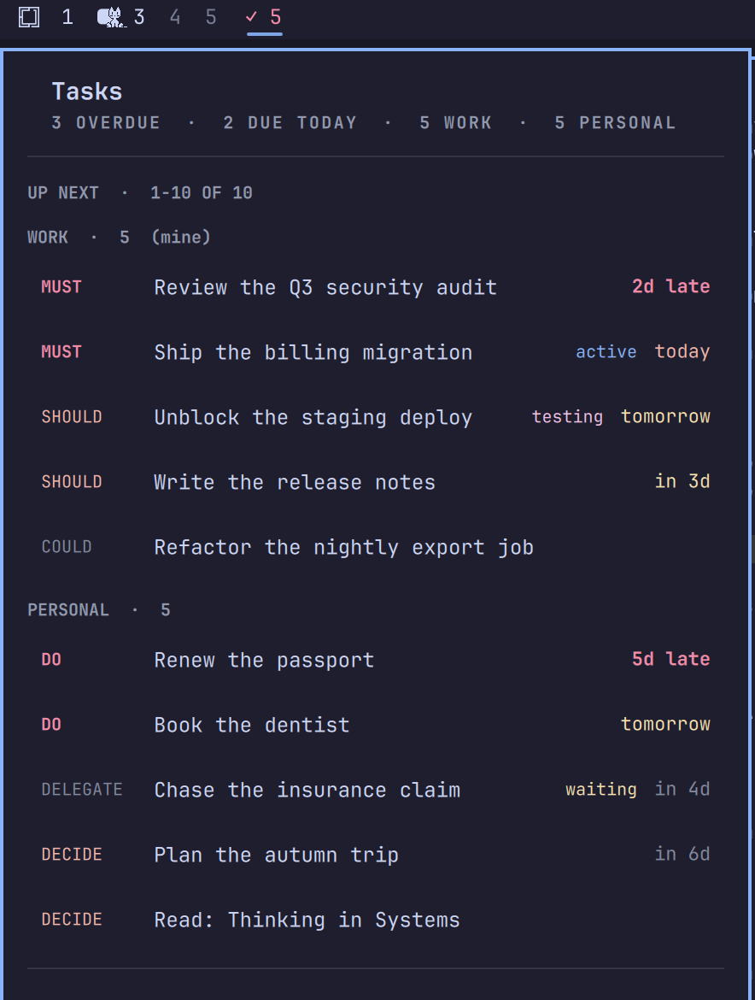
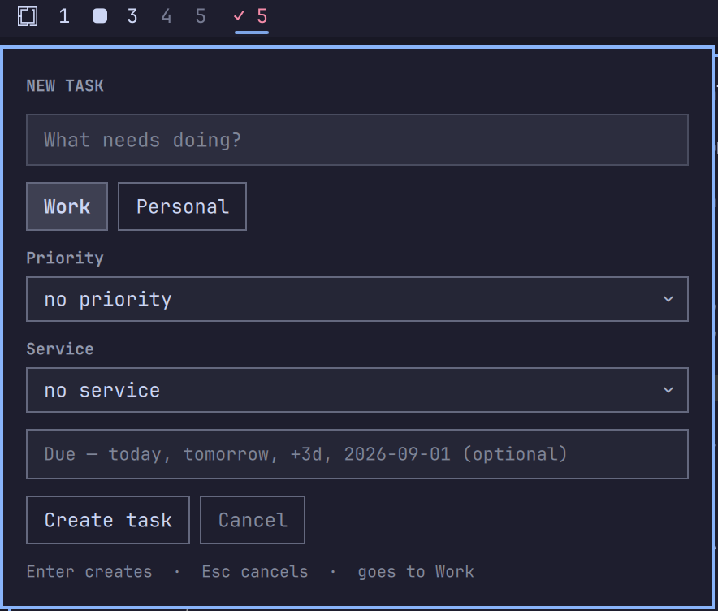

# Notion tasks

An Omarchy bar widget for your open Notion tasks. It merges any number of
Notion databases into one triaged list, tells you what is overdue at a glance,
and lets you finish, restatus and capture tasks without leaving the bar.

- **Bar label** — `✓ N`, where N is overdue + due today, falling back to total
  open when the day is clear. Turns urgent-coloured when anything is overdue.
- **Left click** — the task list. Click a row to open it in Notion.
- **Right click** — refresh now. **Middle click** — open the database.
- **`SUPER + N`** — quick capture from anywhere.



## Nothing about your boards is hardcoded

The only thing you configure is *which* databases to show. How to read them is
worked out from each board schema on every refresh:

| Inferred | How |
|---|---|
| Title, status, date, priority, owner | by property **type**, with the name only breaking ties — so "Due Date" and "Deadline" both just work |
| Priority order | position in the board own option list, so Eisenhower (Do/Decide/Delegate/Delete) and MoSCoW (Must/Should/Could/Won't) both sort correctly |
| Which status means done | the Complete group, skipping anything archive-shaped |
| Which tasks are open | everything the board does **not** file under Complete |
| Capture fields | every select on the board, plus any linked database you opt into |

Two consequences worth knowing. Renaming a status in Notion cannot silently
empty your widget, because the query asks by group rather than by name. And a
board this plugin has never seen — different words, different priorities, no
priority at all — needs no code to work.

## Install

```bash
omarchy plugin add https://github.com/TarasKim/omarchy-notion-tasks --enable
```

Then run the setup below and `omarchy restart shell`.

Needs `jq`, `curl` and `gum` — Omarchy ships all three — and Hyprland for the
window reuse in `open-task.sh` (set `openCommand` to `xdg-open` if you would
rather have browser tabs).

## Setup

```bash
bash ~/.config/omarchy/plugins/io.github.taraskim.notion-tasks/setup.sh
```

It walks you through the four things it cannot guess:

**1. An integration.** Open <https://www.notion.so/profile/integrations> →
**New integration** → internal, your workspace. Under **Capabilities** tick:

| Capability | Needed for |
|---|---|
| Read content | the task list |
| Insert content | quick capture |
| Update content | completing and changing status |

Copy the **Internal Integration Secret** (`ntn_…`) and paste it when asked.

**2. Share your boards with it.** In each database: `⋯` → **Connections** → add
your integration. A board that is not shared returns 404 even with a valid
token, so this is the step people miss.

**3. Who you are.** A workspace integration cannot read back which member owns
it, so setup lists your workspace and asks. This is what "only my tasks" means.

**4. Which databases are task boards.** Setup lists every shared database that
has a title and a status property, and you pick. It deliberately does not
choose for you: sharing a workspace usually exposes clients, cycles and idea
lists that pass the same test, and only you know which ones you work off.

Then add the widget in **Setup → Plugins**, or put `io.github.taraskim.notion-tasks` into
the bar layout in `~/.config/omarchy/shell.json`, and `omarchy restart shell`.

### Files it writes

| File | Contents |
|---|---|
| `~/.config/omarchy/notion-tasks.env` | `NOTION_TOKEN`, mode 600 |
| `~/.config/omarchy/notion-tasks.json` | which boards, in display order |
| `~/.local/state/omarchy/notion-tasks.json` | the cache the widget reads, mode 600 |

The token lives apart from the config on purpose: the config is safe to share
or commit, and the secret is not. The cache is mode 600 as well — it is not a
secret, but it is every open task you have, titles included.

### How the token is handled

Nothing here is exotic, but it is worth being able to check:

- It is **never passed to `curl` on the command line.** `/proc/<pid>/cmdline` is
  world-readable on a stock kernel, so an `Authorization:` header spelled out as
  an argument is readable by every account on the machine for as long as the
  request runs — which, for a five-minute refresh, is most of the time. The
  header is written to a file inside a `mktemp -d` (mode 700) and passed as
  `-H @file`. See `notion_auth_file` in `notion-lib.sh`.
- The env file is **read, not sourced.** `source` executes it, so a stray
  backtick from a bad paste would run as you. `notion_read_token` parses it.
- Ids from the config reach a request path and a filename, so they are checked
  against `^[0-9a-f]{32}$` first.
- The task URL is **never spliced into a shell command.** It is Notion-supplied,
  so it travels as a positional parameter that bash expands without
  re-tokenizing (`Panel.qml`, `openUrl`).

The integration is yours, created in your own workspace, and only reaches the
boards you explicitly share with it. Nothing is sent anywhere except
`api.notion.com`.

## Keys

| Key | Does |
|---|---|
| ↑↓ / `jk` | move the cursor |
| ←→ / `hl`, `[` `]` | change page |
| Enter | open the task in Notion |
| `d` | complete the highlighted task |
| `s` | change its status |
| `n` | new task |
| `1`…`9` | show/hide the nth project |
| `m` | my tasks ⇄ everyone's |
| `g` | grouped ⇄ one flat list |
| `r` | refresh |
| `o` | open the database behind the cursor |
| Esc | close |

`1`…`9`, `m` and `g` persist to `shell.json`.

Like the first arrow key, the first `d` or `s` only wakes the cursor. Aiming
before acting is the point: completing whatever happened to be at the top of
the list because the cursor was not engaged is not a good surprise.

## Changing status

`d` completes; `s` opens a picker with that board's full status list. Both
PATCH the page and re-run the fetch, so a completed task leaves the list in
about a second rather than at the next poll. While the write is in flight the
row dims, the name strikes through and the date column reads `completing…`
— and if Notion rejects the change the row is still there a moment later,
un-struck, with the reason in the popup.

## Quick capture

`SUPER + N` from anywhere, or `n` inside the popup. Enter creates, Esc cancels.

The destination buttons are your configured projects, and the fields below
them are whatever that board carries: its priorities, every select property it
has (Service, Type, Location…), and any linked database you opted into during
setup. A new task is created in the board's first To-do status and assigned to
you, so it lands in your own view instead of a team backlog.

Dates accept `today`, `tomorrow`, `+3d` or `YYYY-MM-DD`.



Linked databases are opt-in because each one costs a query on every refresh; a
task board commonly relates to half a dozen others.

## Colour

Three independent axes, so a row reads without becoming a rainbow:

| Axis | Where | Colours |
|---|---|---|
| Priority | chip | red top of scale · orange upper half · neutral · muted bottom |
| Status | label | blue `active` · yellow `waiting` · magenta `testing` · hidden for todo |
| Due | date | red overdue · orange today · yellow ≤3 days · neutral beyond |

Priority is read *relative to its own board*, so the top of a four-step scale
and the top of a two-step scale look equally urgent. The default state draws no
status label — labelling two thirds of the list "todo" is noise. An unfamiliar
status still gets a colour, from the group Notion files it under.

Omarchy's `Color` singleton exposes only foreground/background/accent/urgent/
muted; it parses the theme's fuller palette and discards it. So the panel reads
`~/.local/state/omarchy/current/theme/colors.toml` itself and resolves
red/orange/yellow/blue/magenta/muted, falling back to an exposed role for any
key a theme omits. `current/theme` is a symlink a theme switch retargets, which
a plain file watch does not reliably see, so it is also re-read on popup open
and on every refresh tick.

## Grouping and paging

With grouping on (the default) the popup draws a headed block per project in
your configured order, and drops the per-row badge as redundant. Turn it off
(`g`) for one flat list where every row is badged.

Grouping is a *sort key*, not a separate rendering path: source is compared
before due date, so paging runs over one flat ordered list and page sizes stay
honest across a group boundary. Each group carries the page-index of its first
row, which is what lets every block share one cursor no matter how many
projects you have.

The cursor indexes the whole ordered list and the page is derived from it, so
walking off the bottom of a page turns to the next one by itself. Header and
footer both show the real range (`1-14 of 55`) — the popup never implies it is
showing everything when it is showing page 1 of 4. The pager hides itself when
the list fits on one page.

## Opening a task

Goes through the bundled `open-task.sh`, which reuses a single task window
instead of leaving one behind per click:

| situation | behaviour |
|---|---|
| that task already open | focus that window |
| otherwise | close previous task windows, open this one |

Chromium derives an `--app` window's class from the **whole URL**, so every
task gets a distinct class and there is no CLI way to navigate an existing app
window — reuse is the closest achievable behaviour. Windows are matched on the
32-hex page id, which is stable in both the URL and the class, rather than by
reimplementing Chromium's slug mangling. The installed Notion app
(`chrome-www.notion.so__*`) is never matched, so it is never closed.

Quattro's Hyprland parses `hyprctl dispatch` as Lua, so the script uses
`hl.dsp.focus` / `hl.dsp.window.close` with a fallback to the legacy
`focuswindow` / `closewindow` form — the same shape `omarchy-launch-or-focus`
uses. Override with `openCommand` (`omarchy-launch-webapp` for a window per
task, `xdg-open` for a browser tab).

## Data flow

`fetch.sh` → `~/.local/state/omarchy/notion-tasks.json` → widget.

The widget only reads the cache, so a failed fetch keeps the last good list on
screen and surfaces the error in the popup. It re-runs `fetch.sh` every
`refreshIntervalSec` (default 300s) and on demand.

Writes go the other way and are never applied to the cache directly:
`create-task.sh` and `set-status.sh` talk to Notion, then re-run `fetch.sh`, so
the cache stays the single description of what is true. A rejected write leaves
the list exactly as it was and shows Notion's own message.

## Settings

Editable in Setup → Plugins, or inline in `~/.config/omarchy/shell.json`:

| Key | Default | Meaning |
|---|---|---|
| `refreshIntervalSec` | 300 | Seconds between fetches (min 60) |
| `pageSize` | 14 | Tasks per page |
| `openCommand` | *(blank)* | Command used to open a task; blank uses `open-task.sh` |
| `hideUnimportant` | true | Hide the lowest priority on each board |
| `groupBySource` | true | A headed block per project |
| `showStatus` | true | Show the status label column |
| `showAllOwners` | false | Include tasks owned by other people |
| `hiddenSources` | `[]` | Project keys switched off with `1`…`9` |
| `label` | `✓` | Bar glyph |

## Project config

`~/.config/omarchy/notion-tasks.json`, written by `setup.sh` and safe to edit:

```json
{
  "version": 1,
  "me": "00000000-0000-0000-0000-000000000000",
  "sources": [
    { "key": "work", "label": "Work",
      "database": "11111111111111111111111111111111",
      "onlyMine": true, "captureRelations": ["Clients"] },
    { "key": "personal", "label": "Personal",
      "database": "22222222222222222222222222222222",
      "onlyMine": false, "captureRelations": [] }
  ]
}
```

| Field | Meaning |
|---|---|
| `me` | your Notion user id; what `onlyMine` compares against |
| `key` | stable id used in the cache and in `shell.json` |
| `label` | shown as the group header and capture button |
| `badge` | optional short tag for the flat list; derived from the label otherwise |
| `onlyMine` | hide tasks owned by other people on this board |
| `captureRelations` | linked databases to offer when creating a task |

Array order is display order: first entry is the first group, and it wins ties
in the sort. Reordering the array reorders the popup, the sort and the number
keys together.

## Files

| File | Role |
|---|---|
| `setup.sh` | interactive: token, identity, board selection |
| `notion-lib.sh` | token reading and auth handling, shared by the four scripts |
| `fetch.sh` | reads every board, writes the cache |
| `notion.jq` | the schema inference, shared by fetch and setup |
| `create-task.sh` | quick capture |
| `set-status.sh` | complete / change status |
| `open-task.sh` | window reuse when opening a task |
| `Panel.qml` | bar button, popup, keyboard |
| `TaskRow.qml`, `StatusForm.qml`, `CaptureForm.qml`, `PagerButton.qml` | popup pieces |
| `Model.js` | filtering, sorting, paging, all Qt-free |

## Development note

`Model.js` is a `.pragma library`, and the QML engine caches those — editing it
does **not** take effect on the plugin hot-reload the way `.qml` edits do. Run
`omarchy restart shell` after changing it. The same applies to adding a new
function to the `IpcHandler`: the target's method list is registered once per
shell process.

The IPC surface is useful while working on it:

```bash
qs -p /usr/share/omarchy/shell ipc call io.github.taraskim.notion-tasks stats
qs -p /usr/share/omarchy/shell ipc call io.github.taraskim.notion-tasks projects
```

## Removing it

```bash
omarchy plugin remove io.github.taraskim.notion-tasks
```

That takes the plugin out of the bar and deletes its directory. Three things
live outside it and are left alone, because they are yours:

```bash
rm ~/.config/omarchy/notion-tasks.env      # the token
rm ~/.config/omarchy/notion-tasks.json     # which boards you chose
rm ~/.local/state/omarchy/notion-tasks.json # the cache
```

Nothing in Notion is touched by removal — no task, status or database is
changed. If you also want the integration gone, revoke it at
<https://www.notion.so/profile/integrations>; that is what actually ends its
access to your workspace.

If you bound `SUPER + N`, drop that line from `~/.config/hypr/bindings.lua`.

## Licence

MIT.
